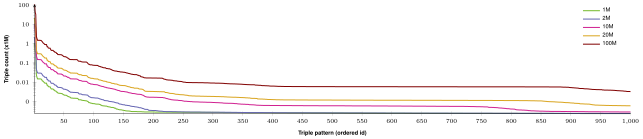

## Conclusions
{:#conclusions}

In this article, we introduced client-side and server-side improvements
to the AMF feature for TPF.
Thanks to the newly introduced benchmarking framework, our experiments are fully and easily reproducible.
As results have shown, our client-side algorithms make average query execution more than two times faster
while only requiring 1/3rd the number of HTTP requests,
at the cost of less than 10% more server CPU usage.

We offer implementations of these algorithms and server enhancements,
which means that it can be used by any of the existing data publishers
that are exposing their data through a TPF interface,
or any client that aims to query from them.

In this section, we conclude our findings with respect to our research questions,
after which we introduce a set of recommendations for data publishers using AMF with TPF.
Finally, we present our perspectives on future work.

### BGP-based Algorithms Improve Query Efficiency

Results show that our new client-side BGP-based algorithms that use AMF metadata
significantly reduce query evaluation times  (_[Research Question 1](#question-combine)_).
However, the are a few outliers where our new algorithms perform _worse_ than the triple-based algorithm.
In the future, heuristical approaches that calculate the potential effectiveness of the BGP-based algorithm
can be investigated to solve this problem.

### BGP-based Algorithms Postpone Time to First Results

Even though total query evaluation times for the AMF-aware algorithms are mostly lower,
the diefficiency values are typically also lower.
The reason for this can be seen when analyzing the times at which each query result arrives, as can be seen with query F3 in ,
and is observable for other queries as well.
This figure shows that the time-until-first-result is higher for BGP-based AMF algorithms.
However, once this first results comes in, the arrival rate becomes much higher compared to the other algorithms.
The reason for this is that the BGP-based algorithms tends to use larger AMFs,
which introduces a bottleneck when requesting them over HTTP.
Even though we have this overhead, the gains we get from this are typically worth it,
as results come in much faster once the AMFs have been downloaded.
This figure shows that dynamically switching between different algorithms may be interesting to investigate in future work.
Our bandwidth experiment results confirm this, and show that higher bandwidths
lead to even more performance gains for the BGP-level algorithms (_[Research Question 4](#question-bandwidth)_).
<em>very</em> well-made point. Although I now start to doubt the point of the diefficiency metric; it just considers those 0.5 where "None" has some results? That's a very harsh punishment for being a twice as late but two times as fast. Would be very different if all results arrived at second 2, but the curve is still nice. What a silly metric. But weren't there multiple dieff values in the original paper?

<figure id="plot_query_times_F3">

<figcaption markdown="block">
Query result arrival times for query F3 for the different client-side algorithms.
</figcaption>
</figure>

### Pre-computation and Caching of AMFs is Essential

Our results show that AMF-aware querying only has a positive impact on query evaluation times
if the server can deliver AMF filters sufficiently fast (_[Research Question 2](#question-cache)_).
Furthermore, if no cache is active, AMF-aware querying performs _worse_ than non-AMF-aware querying.
Ideally, all AMFs should be pre-computed, but due to the large number of possible triple patterns in a dataset,
this is not feasible.
On the other hand, our results have shown that server-side on the fly creation of AMFs
only starts to have a significant impact for sizes larger than 10.000 (_[Research Question 3](#question-dynamic-restriction)_).

On a low-end machine (2,7 GHz Intel Core i5, 8GB RAM), creation of AMFs takes 0.0125 msec per triple,
which means that AMF creation of size 10.000 takes only 0.125 seconds.
As such, AMFs of size 10.000 or less can be created with acceptable durations for Web servers,
after which they can still be cached.

 shows that there is only a very small number of triple patterns with a very large number of matches.
When setting the WatDiv dataset to a size of 10M triples, there are only 90 triple patterns with a size larger than 10.000.
Setting that size to 100M triples, this number increases to 255, so this is not a linear increase.
Due to this low number of very large patterns, we can easily pre-compute these offline before dataset publication time.
Since the WatDiv dataset achieves a high diversity of [_structuredness_, it is similar to real-world RDF datasets](cite:cites realism).
As such, this behavior can be generalized to other datasets with a similar structuredness.

<figure id="plot_triple_pattern_counts">

<figcaption markdown="block">
Logarithmic plot of the number of matches for triple patterns in five datasets of varying sizes,
limited to the 1000 patterns with the most matches.
Triple patterns are sorted by decreasing number of matches.
</figcaption>
</figure>

### Bloom Filters are Preferred over GCS with Active Cache

Results show that when AMFs are pre-computed,
Bloom filters achieve faster query evaluation times than GCS (_[Research Question 2](#question-cache)_).
This is because Bloom filter creation requires less effort client-side than GCS due to the simpler decompression,
at the cost of more server effort.
However, this higher server effort is negligible if AMFs can be pre-computed.
As such, we recommend Bloom filters to always be preferred over GCS, unless AMFs can not be cached.

### A Good Trade-off Between False-positive Probabilities and AMF Size

Lowering the false-positive probability of an AMF increases its size.
As we have seen that larger AMFs have an impact on query evaluation times,
we do not want AMFs to become too large.
On the other hand, we do not want the false-positive probabilities to become too low,
as that leads to more unneeded HTTP requests.
Our results have shown that a probability of 1/64 leads to an optimal trade-off for our experiments (_[Research Question 5](#question-probabilities)_).
However, further research is needed to investigate this trade-off for other types of datasets and queries.

### Recommendations
{:#recommendations}

Based on the conclusions of our experimental results,
we offer the following guidelines for publishers that aim to use the AMF feature:

* Enable **HTTP caching** with a tool such as [NGINX](https://www.nginx.com/).
* **Pre-compute AMFs**, or at least cache, AMFs of size 10.000 or higher.
* If AMFs can be cached, prefer **Bloom filters** over GCS.
* Use a false-positive **probability of 1/64**.

### Future work

Even though we answered many open questions regarding AMFs,
there are a couple of new questions.
First, we need investigation on ways to dynamically switch between different kinds of client-side AMF algorithms.
Second, dynamically switching between algorithms may improve diefficiency,
as the BGP-based algorithm postpones time until first result.
Finally, as approaches such as [Solid](cite:cites solid) are pushing towards a more _decentralized_ Web,
investigation of AMFs in the context of federated querying is needed,
which is not trivial, as filters of multiple sources may need to be combined.
