## Evaluation
{:#evaluation}

The goal of this section is to answer the research questions from [](#problem-statement).
We start by introducing a reusable benchmarking framework to achieve fully reproducible results.
Next, we briefly discuss the implementations of our algorithm.
After that, we present our experimental setup and our statistical hypotheses.
Finally, we present our results and testing of our hypotheses.

Anonymized code and results results can be found at <a href="https://www.dropbox.com/s/nuj7l72wglpzx4p/data.zip">https://www.dropbox.com/s/nuj7l72wglpzx4p/data.zip</a>.

### Reusable Benchmarking Framework

Different Linked Data Fragments approaches as discussed in [](#related-work-ldf)
usually require similar steps when running experiments.
Such experiments require a significant amount of manual effort
for setting up experiments, running them, and generating plots.
In order to avoid re-inventing the wheel, and for future works in this domain,
we developed a reusable benchmarking framework for Linked Data Fragments experiments, called _Comunica Bencher_.
This tool is based on [Docker](https://www.docker.com/), and allows isolated execution of experiments over different containers.
Experiment configurations are fully _declarative_, and they can exist in standalone repositories.
In order to share the conditions under which the experiment was executed,
a list of all [used _software versions and their dependencies_ in a Turtle document](cite:cites lsd)
will be generated after each run together with the evaluation results.
Comunica Bencher is _open-source_, and will be available on GitHub.
With this, our experiments are fully reproducible.

Concretely, Comunica Bencher offers abstraction of the following <a about="#evaluation-workflow" content="Comunica Bencher evaluation workflow" href="#evaluation-workflow" property="rdfs:label" rel="cc:license" resource="https://creativecommons.org/licenses/by/4.0/">workflow</a>:

<ol id="evaluation-workflow" property="schema:hasPart" resource="#evaluation-workflow" typeof="opmw:WorkflowTemplate" markdown="1">
<li id="workflow-data" about="#workflow-data" typeof="opmw:WorkflowTemplateProcess" rel="opmw:isStepOfTemplate" resource="#evaluation-workflow" property="rdfs:label" markdown="1">
  Generate a [WatDiv](cite:cites watdiv) dataset with a given scale factor.
</li>
<li id="workflow-queries" about="#workflow-queries" typeof="opmw:WorkflowTemplateProcess" rel="opmw:isStepOfTemplate" resource="#evaluation-workflow" property="rdfs:label" markdown="1">
  Generate the corresponding default WatDiv [queries](https://dsg.uwaterloo.ca/watdiv/basic-testing.shtml) with a given query count.
</li>
<li id="workflow-tpf-server" about="#workflow-tpf-server" typeof="opmw:WorkflowTemplateProcess" rel="opmw:isStepOfTemplate" resource="#evaluation-workflow" property="rdfs:label" markdown="1">
  Install [the LDF server software](https://github.com/LinkedDataFragments/Server.js){:.mandatory} with a given configuration, implementing the [TPF specification](https://www.hydra-cg.com/spec/latest/triple-pattern-fragments/).
</li>
<li id="workflow-cache" about="#workflow-cache" typeof="opmw:WorkflowTemplateProcess" rel="opmw:isStepOfTemplate" resource="#evaluation-workflow" property="rdfs:label" markdown="1">
  Setup an [NGINX HTTP cache](https://www.nginx.com/){:.mandatory} with a given configuration in front of the LDF server.
</li>
<li id="workflow-comunica" about="#workflow-comunica" typeof="opmw:WorkflowTemplateProcess" rel="opmw:isStepOfTemplate" resource="#evaluation-workflow" property="rdfs:label" markdown="1">
  Install [Comunica](cite:cites comunica) under a given configuration, implementing [SPARQL 1.1](https://www.w3.org/TR/sparql11-protocol).
</li>
<li id="workflow-comunica-run" about="#workflow-comunica-run" typeof="opmw:WorkflowTemplateProcess" rel="opmw:isStepOfTemplate" resource="#evaluation-workflow" property="rdfs:label" markdown="1">
  Execute the generated WatDiv queries a given number times on the Comunica client, after doing a warmup run, and record the execution times.
</li>
<li id="workflow-collect" about="#workflow-collect" typeof="opmw:WorkflowTemplateProcess" rel="opmw:isStepOfTemplate" resource="#evaluation-workflow" property="rdfs:label" markdown="1">
  For each experiment, plot the execution times for all combinations and queries next to each other.
</li>
</ol>

### Implementation

For implementing the client-side AMF algorithms,
we make use of JavaScript-based [Comunica SPARQL querying framework](cite:cites comunica).
Since Comunica already fully supports the TPF algorithm,
we could implement our algorithms as fully standalone plugins.
Our algorithms are implemented in separate Comunica modules,
and will be available open-source on GitHub.
Concretely, we implemented the original triple-based AMF algorithm,
our new BGP-based AMF algorithm (_BGP Simple_),
and a variant of this BGP-based algorithm (_BGP Combined_) that pre-fetches out-of-band AMFs in parallel.

The original TPF server extension in [the LDF server software](https://github.com/LinkedDataFragments/Server.js/tree/feature-handlers-amf)
by [Vander Sande et al.](cite:cites amf2015)
allowed both Bloom filters and GCS to be created on the fly for any triple pattern.
To support our experiments, we extended this implementation with new features.
This implementation will be available on GitHub.
In order to measure the server overhead of large AMFs,
we added a config option to dynamically enable AMFs for triple patterns
with number of matching triples below a given result count threshold.
Next to that, we implemented an optional file-based cache to avoid recomputing AMFs
to make pre-computation of AMFs possible.
Finally, we added support for exposing AMFs in-band with HTTP responses,
instead of including them behind a followable link into these responses.
An example of this in-band metadata can be seen in [](#amf-metadata-inband),
which is equivalent to the out-of-band metadata from [](#amf-metadata-outband).

<figure id="amf-metadata-inband" class="listing">
````/code/amf-metadata-inband.trig````
<figcaption markdown="block">
Self-descriptive in-band AMF metadata in a TPF response for `ex:mysubject ?p ?o`,
which allows intelligent clients to detect, interpret and make use it.
</figcaption>
</figure>

### Experimental Setup

Based on our LDF server and Comunica implementations that were discussed in [](#implementation),
we defined five experiments, corresponding to our five research questions from [](#problem-statement).
For each experiment, we introduce hypotheses that will be statistically tested based on our results.
The declararive configuration files for running these experiments with Comunica Bencher will be present on GitHub under an open license,
and can be started from scratch by _executing a single command_.
Furthermore, all raw results and scripts for analyzing them can be found in this same repository.

The following experiments execute WatDiv with a dataset scale of 100
and a query count of 5 for the default query templates, leading to a total of 100 queries.
We only report results for Bloom filters for experiments
where no significant difference was measured with GCS.
Each experiment includes a warmup phase,
and averages results over 3 separate runs.
During this warmup phase, the server caches all generated AMFs.
For each query, 
the client-side timeout was set to 5 minutes and, to enforce a realistic Web bandwidth,
the network delay was set to 1024Kbps.
All experiments were executed on a 64-bit Ubuntu 14.04 machine with 128 GB of memory and a 24-core 2.40 GHz CPU---each Docker container was limited to one CPU core, behind an NGINX HTTP cache.

1. **Client-side AMF Algorithms**:
    In this experiment, we compare different client-side algorithms
    (_None, Triple, BGP Simple, BGP Combined, Triple with BGP Combined_)
    for using AMF metadata.
    <br />
    We expect that client-side algorithms that make use of AMFs will be faster than not using AMFs at all,
    and that our new BGP-level AMF algorithm is faster than the existing triple-level AMF algorithm.
    <br />
    **Hypotheses:**
    1. {:#hypo-combine-1} By combining AMFs client-side at BGP-level, query execution time is lower compared to plain TPF.
    2. {:#hypo-combine-2} By combining AMFs client-side at BGP-level, query execution time is lower compared to using AMFs at triple-level.
    3. {:#hypo-combine-3} Using AMFs at both BGP _and_ triple-level does not reduce query execution time compared to only using AMFs at BGP-level.
2. **Caching**:
    In this experiment, we evaluate the effects of caching all HTTP requests combined with caching AMF filters server-side,
    both following the LRU cache replacement strategy.
    We also compare the effects of using AMF metadata client-side or not.
    Finally, we test the effects of warm and cold caches.
    <br />
    We expect that HTTP-level caching will be more effective than the server-side caching of AMF filters.
    Furthermore, we expect that AMF-aware query evaluation will only be effective when caching is active,
    due to the potentially long creation times of AMFs.
    Following the predictions of Vander Sande et al., we expect that Bloom-based AMFs will lead to
    faster query execution compared to GCS when the cache is warm.
    <br />
    **Hypotheses:**
    1. {:#hypo-cache-1} Caching all HTTP responses reduce query evaluation times more than caching only AMFs responses.
    2. {:#hypo-cache-2} Caching AMFs server-side when an HTTP cache is active has no effect on query evaluation times.
    3. {:#hypo-cache-3} Without HTTP caching, AMF-aware query evaluation is slower than non-AMF query evaluation.
    4. {:#hypo-cache-4} With HTTP caching, AMF-aware query evaluation is faster than non-AMF query evaluation.
    5. {:#hypo-cache-5} With a warm cache, Bloom filters achieve lower query evaluation times compared to GCS.
3. **Dynamically Enabling AMF**:
    In this experiment, we compare different result count thresholds (_0, 1.000, 10.000, 100.000, 1.000.000_) with each other,
    with either the server-side AMF filter cache enabled or not.
    We disable the HTTP cache and warmup phase to evaluate a cold-start.
    <br />
    Even if AMFs are cached, we expect that lower thresholds will slow down query execution,
    as this would mean that no AMFs are created for fragments with large result counts,
    requiring clients to download a large amount of data.
    Furthermore, we expect that lowering thresholds will only impact server load when caching is disabled,
    as repeatedly recalculating AMFs is expected to be more server-intensive than serving paged fragments in TPF.
    <br />
    **Hypotheses:**
    1. {:#hypo-dynamic-restriction-1} With cached AMFs, lower thresholds slow down query execution.
    2. {:#hypo-dynamic-restriction-2} Without cached AMFs, lower thresholds reduce server load.
    3. {:#hypo-dynamic-restriction-3} With cached AMFs, lower thresholds do not impact server load.
4. **Network Bandwidths**:
    Different network bandwidths (_256kbps, 512kbps, 2048kbps, 4096kbps_) are tested for evaluating network speedups,
    and their effects or different AMF algorithms (_None, Triple, BGP Combined_) are tested.
    <br />
    Since the amount of downloaded data has been shown to be the main cause for high execution times for TPF,
    and the usage of AMFs reduces the number of HTTP requests,
    we expect that triple-level AMF usage will be less impacted by lower HTTP bandwidth.
    We expect that this impact will be even less for BGP-level AMF usage due to the further reduction of number of HTTP requests.
    <br />
    **Hypotheses:**
    1. {:#hypo-bandwidth-1} HTTP bandwidth has a higher impact on non-AMF usage than triple-level AMF usage.
    2. {:#hypo-bandwidth-2} HTTP bandwidth has a higher impact on triple-level AMF usage than BGP-level AMF usage.
5. **In-band vs. Out-of-band**:
    For this experiment, we test the effects of different triple count thresholds (_0, 1.000, 10.000, 100.000, 1.000.000_) for exposing AMF metadata in-band or not.
    <br />
    Since AMF-aware TPF clients will follow links to AMFs in most cases,
    we expect that the in-band inclusion of AMFs into HTTP responses
    will be able to reduce the query execution times as the number of HTTP requests will be lower.
    <br />
    **Hypotheses:**
    1. {:#hypo-inband-1} In-band AMF metadata speeds up client-side query evaluation.
    2. {:#hypo-inband-2} In-band AMF metadata reduces the total amount of HTTP requests.
6. **False-positive Probabilities**:
    In this final experiment, we compare different AMF false-positive probabilities (_1/4096, 1/1024, 1/64, 1/4, 1/2_).
    <br />
    We expect that lower chances on false positives will lead to fewer unneeded HTTP requests,
    and thereby faster query exection.
    <br />
    **Hypotheses:**
    1. {:#hypo-probabilities-1} Lower probabilities lead to faster client-side query execution.

### Results

In this section, we present the results for each of our experiments separately.
We tested our hypotheses statistically by comparing means using the Kruskal-Wallis test,
and report on their p-values (_low values indicate non-equal means_).

#### Client-side AMF Algorithms
{:.display-block}

<figure id="plot_client_algos">
<center>
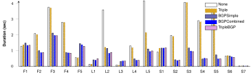
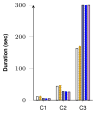
</center>
<figcaption markdown="block">
Query evaluation times for the different client-side algorithms for using AMF metadata, lower is better.
BGP-based approaches are mostly faster.
</figcaption>
</figure>

<figure id="plot_query_times_F3">
<center>
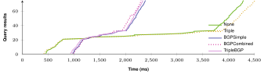
</center>
<figcaption markdown="block">
Query result arrival times for query F3 for the different client-side algorithms.
</figcaption>
</figure>

<figure id="http_requests_cache" markdown="1">

| Approach    | Requests  | Relative requests | Cache hits | Cache hit rate |
| ----------- | ---------:| -----------------:| ----------:| --------------:|
| None        | 1,911,845 |           100.00% | 1,686,889  | 88.23%         |
| Triple      | 1,837,886 |            96.13% | 1,626,611  | 88.50%         |
| BGPSimple   | 191,764   |            10.03% | 173,617    | 90.53%         |
| BGPCombined | 191,768   |            10.03% | 173,621    | 90.53%         |
| TripleBGP   | 191,773   |            10.03% | 173,626    | 90.53%         |

<figcaption markdown="block">
Number of HTTP requests, number of HTTP requests relative to not using AMFs, number of cache hits and cache hit rate for the different client-side algorithms.
</figcaption>
</figure>

<figure id="plot_skip_bgp_heuristic">
<center>

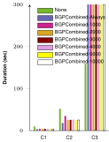
</center>
<figcaption markdown="block">
Query evaluation times when enabling the heuristic in the client-side combined BGP algorithm.
The heuristic shows a slight improvement in most cases.
</figcaption>
</figure>

[](#plot_client_algos) shows the query evaluation times for our first experiment
on the different client-side algorithms for using AMF metadata.
In line with what was shown in the [first TPF AMF experiments](cite:cites amf2015),
the triple-based algorithm reduces query evaluation times in only 2 of the 20 queries.
Our new BGP-based algorithms on the other hand reduce query evaluation times and outperforms the triple-based algorithm.
Only for 5 of the 20 queries, evaluation times are higher or equal.
Our combined BGP algorithm is slightly faster than the simple BGP algorithm.
By using both the combined BGP-based and the triple-based algorithms, we can reduce evaluation times slightly further.

[](#plot_query_times_F3) shows the query result arrival times for query F3,
and is similar to the arrival times for other queries.
This figure shows that the time-until-first-result is the highest for BGP-based AMF algorithms.
However, once this first results comes in, the arrival rate becomes much higher compared to the other algorithms.
This delay for the BGP-based algorithms is caused by the higher download times for large AMFs,
and explains the higher or equal evaluation times for 5 of the 20 queries.

[](#http_requests_cache) shows the BGP-based algorithms significantly lower the number of required HTTP requests,
which explains the significant reduction in query execution times.
This allows the NGINX cache hit rate to slightly increase compared to the regular and triple-based TPF algorithms,
since fewer requests are made, which lowers the number of required cache evictions.

Based on these results, we confirm that there is _no statistically significant difference_
between the evaluation times of the triple-based AMF algorithm, and not using AMF metadata at all (_p-value: 0.9318_).
The simple and combined BGP algorithms are significantly faster than not using AMF metadata (_p-values: 0.0062, 0.0026_),
which confirms [Hypothesis 1.1](#hypo-combine-1).
Furthermore, the simple and combined BGP algorithm are on average
more than twice as fast as the triple-based algorithm,
which make them significantly faster (_p-values: 0.0090, 0.0041_)
and confirms [Hypothesis 1.2](#hypo-combine-2).
Furthermore, combining our simple and combined BGP algorithm with the triple-based algorithms
shows no further statistically significant improvement (_p-values: 0.9484, 0.6689_), which confirms [Hypothesis 1.3](#hypo-combine-3).

In [](#plot_skip_bgp_heuristic), we show the results where we apply the heuristic
for dynamically disabling the BGP heuristic based on different parameter values.
On average, setting the request size parameter value to 2000 has the lowest average evaluation time for this experiment.
This case achieves lower evaluation times for 19 of the 20 queries,
which is an improvement compared to not using the heuristic.
This improvement by itself however only small, and not statistically significant (_p-value: 0.1842_).

#### Caching
{:.display-block}

<figure id="plot_caching">
<center>
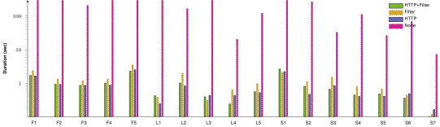
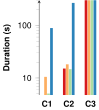
</center>
<figcaption markdown="block">
Logarithmic query evaluation times comparing server-side HTTP and AMF caching.
Not caching anything is always slower than caching HTTP responses or AMFs.
</figcaption>
</figure>

[](#plot_caching) shows that caching either HTTP requests or AMF filters server-side has a significant positive effect on query evaluation times (_p-value: < 0.0001_).
We observe that caching HTTP requests reduces query evaluation times _more_ than just caching AMF filters (_p-value: 0.0225_),
which confirms [Hypothesis 2.1](#hypo-cache-1).
Furthermore, there is no significant difference between query evaluation times for caching of both HTTP requests and AMF filters
compared to just caching HTTP requests (_p-value: 0.7694_), so we accept [Hypothesis 2.2](#hypo-cache-2).
This shows that an HTTP cache achieves the best results,
and additionally caching AMF filters server-side is not worth the effort.

If we compare these results with the results for non-AMF-aware querying,
we see that if HTTP caching is _disabled_, query evaluation times for non-AMF-aware querying are _significantly lower_ than AMF-aware approaches (_p-value: < 0.0001_), which confirms [Hypothesis 2.3](#hypo-cache-3).
On the other hand, if HTTP caching is _enabled_, query evaluation times for non-AMF-aware querying are _significantly worse_ than with AMF-aware approaches (_p-value: < 0.0001_), which confirms [Hypothesis 2.4](#hypo-cache-4).
While caching is already very important for TPF-based querying,
these results show that caching becomes _even more important_ when AMFs are being used.

Finally, our results show that when our cache is warm, exposing Bloom filters instead of GCS achieves faster query evaluation times.
While there are a few outliers where GCS is two to three times slower,
the difference is only small in most cases, so we accept [Hypothesis 2.5](#hypo-cache-5) with a low significance (_p-value: 0.1786_).

#### Dynamically Enabling AMF
{:.display-block}

<figure id="plot_server_metadata_enabled_cached">
<center>
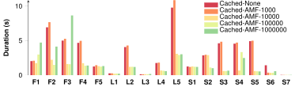
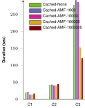
</center>
<figcaption markdown="block">
Query evaluation times for different AMF result count thresholds and AMF algorithms when HTTP caching is enabled.
Low result count thresholds slow down query execution.
</figcaption>
</figure>

<figure id="plot_server_metadata_enabled_notcached">
<center>
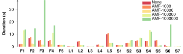
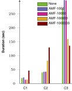
</center>
<figcaption markdown="block">
Query evaluation times for different AMF result count thresholds and AMF algorithms when HTTP caching is disabled.
High result count thresholds slow down query execution.
</figcaption>
</figure>

<figure id="plot_threshold_serverload">
<center>
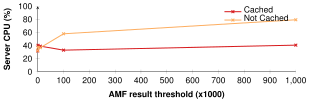
</center>
<figcaption markdown="block">
Average server CPU usage increases when AMF result count thresholds increase
when caching is disabled, but much slower if caching is enabled.
</figcaption>
</figure>

[](#plot_server_metadata_enabled_cached) shows lower server-side AMF result count thresholds
lead to higher query evaluation times when HTTP caching is enabled (_p-value: < 0.0001_),
which confirms [Hypothesis 3.1](#hypo-dynamic-restriction-1).
[](#plot_server_metadata_enabled_notcached) shows that AMF result count thresholds
also have an impact on query evaluation times when HTTP caching is disabled (_p-value: 0.0005_),
but it does not necessarily lower it.
For this experiment, setting the threshold to 10K leads to the lowest overall query evaluation times.

[](#plot_threshold_serverload) shows that lower AMF result count thresholds lead to lower server loads
when HTTP caching is disabled (_p-value: 0.0326_), which confirms [Hypothesis 3.2](#hypo-dynamic-restriction-2).
On the other hand, if HTTP caching is enabled,
there is no correlation (_Pearson_) between AMF result count threshold and server CPU usage (_p-value: 0.4577_), which confirms [Hypothesis 3.3](#hypo-dynamic-restriction-3)).
This shows that if caching is enabled, dynamically enabling AMFs based on the number of triples
is not significantly important,
and may therefore be disabled to always expose AMFs.

For this experiment, average CPU usage increased from 31.65% (no AMF) to 40.56% (all AMF) when caching is enabled.
Furthermore, when looking at the raw HTTP logs,
we observe that by _always_ exposing AMFs, we use 28.66% of the total number of HTTP requests compared to not exposing AMFs.
As such, AMFs significantly reduce the number of HTTP requests at the cost of ~10% more server load.

<figure id="plot_delay_none">
<center>
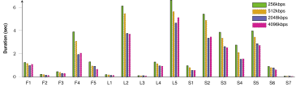

</center>
<figcaption markdown="block">
When AMF is not used, query evaluation times decrease with increased bandwidth.
</figcaption>
</figure>

<figure id="plot_delay_triple">
<center>
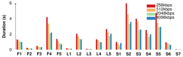
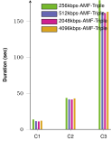
</center>
<figcaption markdown="block">
When the triple-based AMF algorithm is used, query evaluation times decrease with increased bandwidth.
</figcaption>
</figure>

<figure id="plot_delay_bgp">
<center>
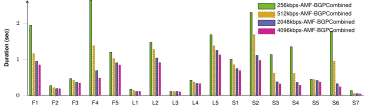
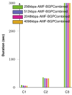
</center>
<figcaption markdown="block">
When the BGP-based AMF algorithm is used, query evaluation times decrease with increased bandwidth.
</figcaption>
</figure>

#### Network Bandwidth
{:.display-block}

[](#plot_delay_none), [](#plot_delay_triple) and [](#plot_delay_bgp) show the effects of different bandwidths
on query evaluation times over different algorithms.
We observe that when not using AMF, or using the triple-level AMF algorithm,
lower bandwidths lead to higher query evaluation times.
However, when bandwidths become much higher,
query evaluation times decrease at a lower rate.
In contrast, the BGP-level AMF algorithm continuously becomes faster when bandwidth increases.
We do not measure any significant impact of bandwidth on both non-AMF usage and triple-level AMF usage (_p-values: 0.2905, 0.2306_), so we reject [Hypothesis 4.1](#hypo-bandwidth-1).
For BGP-level AMF, we measure a significant impact (_p-value: 0.0028_), which accepts [Hypothesis 4.2](#hypo-bandwidth-2).
This shows that _if_ BGP-level AMF is used,
then higher bandwidths can be exploited _more_ for faster query evaluation.

#### In-band vs. Out-of-band
{:.display-block}

<figure id="plot_in_vs_out_band">
<center>
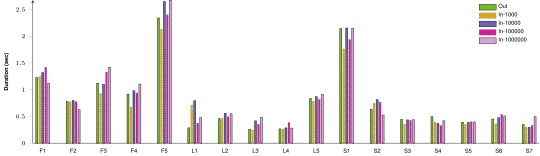
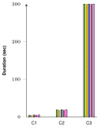
</center>
<figcaption markdown="block">
Query evaluation times comparing out-of-band and in-band based on different
AMF triple count threshold show no major differences.
</figcaption>
</figure>

[](#plot_in_vs_out_band) shows query evaluation times for different possibilities for including AMF metadata in-band or out-of-band.
Statistically, there is no significant different difference between these combinations (_p-value: 0.7323_),
so we reject [Hypothesis 5.1](#hypo-inband-1).

Furthermore, when analyzing the HTTP logs, we observe only a very decrease (<1%) in the number of requests for in-band AMF metadata.
As this difference is insignificant (_p-value: 0.406_), we need to reject [Hypothesis 5.2](#hypo-inband-2)
in which we expected the number of HTTP requests to significantly increase when we moved AMF metadata out-of-band.

#### False-positive Probabilities
{:.display-block}

<figure id="plot_probabilities">
<center>

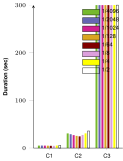
</center>
<figcaption markdown="block">
Query evaluation times comparing different false-positive probabilities for AMFs that are generated server-side.
Extremely low and high probabilities show a negative impact.
</figcaption>
</figure>

[](#plot_probabilities) shows that different false-positive probabilities have impact on query evaluation times.
This impact has however only a weak significance (_p-value: 0.1840_).
This means that we reject [Hypothesis 6.1](#hypo-probabilities-1)
in which we expected that lower false-positive probabilities lead to lower query evaluation times.
On average, a false-positive probability of 1/64 leads to the lowest overall query evaluation times for this experiment.
